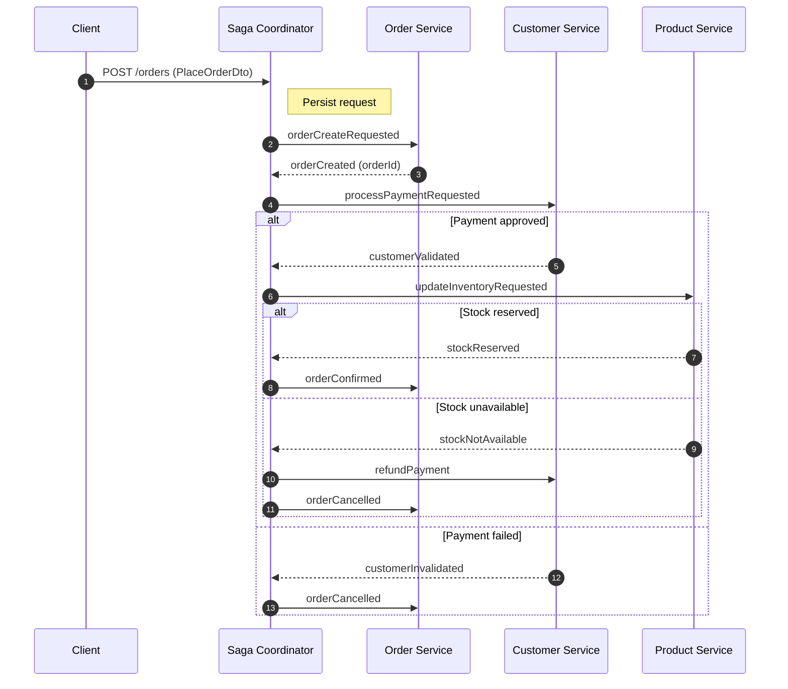

## Order Creation Saga (Flow Overview)



### Possible Status Values

- `processing`: Request accepted and in progress.
- `order_created`: Order created by order-service.
- `customer_validated`: Payment approved.
- `customer_invalidated`: Payment failed.
- `stock_reserved`: Inventory reserved.
- `stock_not_available`: Inventory not available.
- `order_confirmed`: Order confirmed.
- `order_cancelled`: Order cancelled.

### Failure & Retry Behavior

- Failed messages are `nack`ed and requeued for retry.
- After 5 retries, messages are `nack`ed without requeue and routed to DLX/DLQ.
- Request state is stored in DB (table `order_requests`) to stay consistent across workers.

## Project setup

```bash
$ npm install
```

## Compile and run the project

```bash
# development
$ npm run start

# watch mode
$ npm run start:dev

# production mode
$ npm run start:prod
```

## Run tests

```bash
# unit tests
$ npm run test

# e2e tests
$ npm run test:e2e

# test coverage
$ npm run test:cov
```
